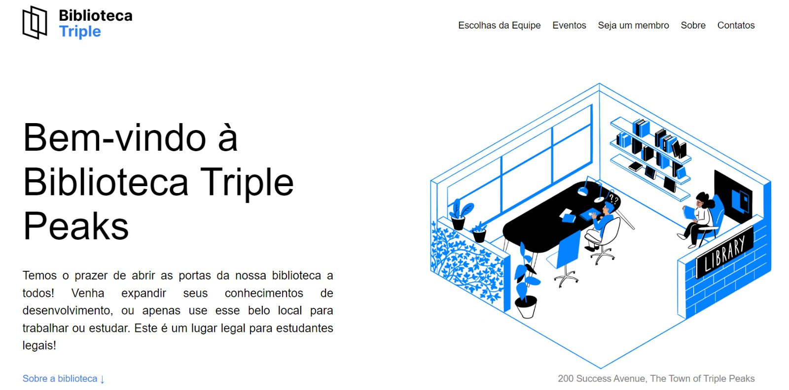

# Projeto Library

BootCamp Desenvolvimento Web - TripleTen

  

- <a href="https://danniela-91.github.io/web_project_library/" target="_blank">Veja o projeto completo</a>

## 🚀 Tecnologias

Esse projeto foi desenvolvido com as seguintes tecnologias:

- HTML5
- CSS
- Flexbox
- Git e Github

## 💻 Projeto

A página da Biblioteca Triple Peaks é o primeiro projeto no programa de desenvolvedor de software na TripleTen.

---

Feito com ♥ by Daniela Tenório
